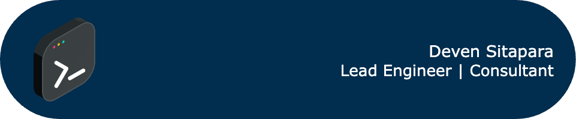

# Deven Sitapara

---

# 👨‍💻 Who Am I?

**Senior Engineer | SaaS | Consultant** 

A seasoned Indian engineer and consultant with extensive experience in product development, from ideation to deployment. Specializing in building robust, scalable SaaS solutions that transform client visions into reality. Proven track record in leading development teams and delivering high-quality products across various industries.

---
# 📧 Contact

🌍 Rajkot, India  
📞 Contact: [+91-9979907571](https://wa.link/bi5653)  
📞 Skype: [dev.srs](https://join.skype.com/invite/Ie2StEKkCdTA)  
📧 Email: devensitapara@gmail.com   

---
# 🌟 Industries I helped

With over 18 years of experience, I've successfully delivered solutions across diverse sectors, helping following industries to transform their operations through technology. 

--- 
# 🌟 Type of Applications Used 

Throughout my career, I've developed a wide range of applications create, used or integrated, each tailored to specific business needs and industry requirements. Here are some of the key types of applications I've built:

- CMS (Content Management Systems)
- ERP (Enterprise Resource Planning)
- SaaS (Software as a Service)
- CRM (Customer Relationship Management)
- E-commerce Solutions
- Payment Gateways
- API Integrations
- Blog Platforms
- Social Media Integration Platforms
- Mobile Applications
- Data Analytics Tools
- Document Management Systems
- Workflow Automation Tools
- Inventory Management Systems
- Reporting Dashboards

---
# 🌟  Products & Tools

Here are some of my notable projects. These showcase my skills in developing scalable, user-friendly applications across different domains and technologies.

## 📔 Enterprise Products
| Name | Type | Used Applications | Short Description | URLs |
|------|------|------------------|-------------------|------|
| SaaS for Sport Clubs | SaaS | React, Node.js, MongoDB | Modern web-based solution for sports management | [GitHub](https://github.com/deven-sitapara/sport-club-saas-app) |
| Legal SaaS App | SaaS | Laravel, MySQL | Complete ERP solution for Law firms | [GitHub](https://github.com/deven-sitapara/legal-saas-app) |
| Cendyn CMS | CMS | PHP, Zend, MySQL | Hospitality content management system | [Info](https://help.cendyn.com/hc/en-us/articles/4406839122587) |
| Neon-Soft | ERP | PHP, Laravel, MSSQL | Telecom ERP with integrated systems | [Website](https://neon-soft.com) |
| Price Donkey | SaaS | Python, AWS | Vendor price management system | [Demo](https://www.youtube.com/watch?v=LjG8qEBOSHU) |
| RepDonkey | SaaS | PHP, MySQL | Sales Agency management solution | [Website](https://repdonkey.com/) |

## 🔧 Tools, Plugins and Integrations
| Title | Use | Link |
|-------|-----|------|
| Cloudscape Design Kit | AWS Cloudscape Design System based SaaS starter | [GitHub](https://github.com/deven-sitapara/cloudscape-design-system-start-kit) |
| Carbon Design Kit | IBM Carbon Design System based SaaS starter | [GitHub](https://github.com/deven-sitapara/Carbon-Design-System-With-Next.js-Start-Kit) |
| MERN Messaging | Real-time messaging application template | [GitHub](https://github.com/deven-sitapara/mern-messaging/tree/main) |
| CSV To Zoho Invoice | Zoho Invoice integration tool | [Demo](https://www.youtube.com/watch?v=JhVE8edHX80) |
| Docusign Integration | Zoho-Docusign integration tool | [Demo](https://www.youtube.com/watch?v=8Jr5-ym0ePc) |
| WP Interview Plugin | WordPress candidate management plugin | [Demo](https://www.youtube.com/watch?v=6IfjdxTy8pY) |
| pdf2csv | PDF to CSV conversion tool | [GitHub](https://github.com/deven-sitapara/pdf2csv) |
| Docker Saas Starter | One-click Docker SaaS setup for Windows | [Demo](https://www.youtube.com/watch?v=gLXXCe4Nn7o) |
| PayPal Module | Opencart PayPal integration module | [Demo](https://www.youtube.com/watch?v=iT6DerNAsys) |
| Authorize.net Module | Opencart Authorize.net 3D secure module | [Demo](https://www.youtube.com/watch?v=ka_vFl5nhj8) |

---

## 👨‍💻 My Approach

I believe in:
- **Clean Architecture**: Building systems that are easy to understand and maintain
- **User-Centered Design**: Creating experiences that solve real problems for users
- **Continuous Learning**: Staying current with emerging technologies and best practices
- **Collaborative Development**: Working closely with stakeholders to ensure alignment with business goals

 ---

# 👨‍💻 Experience

## Sr Developer - Production  
**Feb 2023 - Aug-2024 | Cendyn (Pegasus), Hyderabad**  
- Developing and enhancing features for ecommerce hospitality products.  
- **Tech Stack:**  
   
   
   
   
  

## Sr. Developer  
**Nov 2022 - Feb 2023 | Quantum Dynamics Limited, France**  
- Built web app modules and APIs for FIDUCIAL Bank of France.  
- **Tech Stack:**  
   
   
   
   
    
  - [Bansira](https://bansira.com)

## Team Leader, Project Architect  
**Aug 2020 - Sep 2022 | GKB Labs Pvt Ltd, Hyderabad**  
- Developed B2B products in healthcare and AV industries, increasing sales and performance significantly.  
- **Tech Stack:**  
   
  
   
    
  - [Pricedonkey](https://pricedonkey.net) | [MensHealthClinic](https://menshealthclinic.com)

## Sr. Developer, Team Leader  
**Jan 2015 - Jan 2020 | Code-Desk Pvt Ltd, UK**  
- Developed Telecom ERP with multiple integrated systems, enhancing customer base and process efficiency.  
- **Tech Stack:**  
   
   
   
   
   
    
  - [Neon-Soft](http://neon-soft.com)

## Sr. Full Stack Developer  
**Jul 2012 - Dec 2015 | Phoenix Biz Solutions, Cardiff**  
- Developed custom eCommerce modules for a large furniture company.  
- **Tech Stack:**  

## Full Stack Freelancer  
**Jul 2006 - Dec 2012 | Self-Employed**  
- Provided custom web and software development services.
- **Tech Stack:**  
   
   
   
   
    
  - [BlueBananaClothing](https://www.bluebananaclothing.com) | [SimplySuave](https://simplysuave.co.nz)

---

  
---

### 💼 Skills

#### Backend:

#### Frameworks:

 

#### Frontend:

#### Databases:

#### APIs:

#### DevOps:

#### Linux:

#### Testing:

#### Design:

#### Project Management:

---

### 🎓 Certifications

- **DevOps Certification Training** - Edureka
- **Linux Server Administration** - Edureka
- **MySQL DBA** - Edureka

---

### 🎓 Education

**Bachelor of Engineering in Computer Engineering**  
*Atmiya University | 2002 - 2006*

---

---

🌱 I'm currently focusing on refining my skills in advanced DevOps practices and cloud-native technologies. 

🚀 Passionate about building scalable solutions and continuously improving processes to deliver optimal results.

---

Thank you for taking the time to visit my GitHub profile. 
Feel free to explore my projects, and don't hesitate to reach out if you have any questions or opportunities for collaboration. 
Together, we can make a positive impact in the world of software development!

